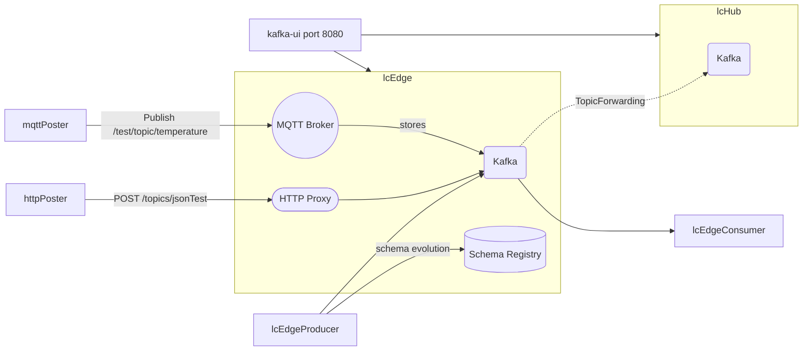

# lc-demo

## Services

* `lcEdge`

  LeafCuttr instance with all features enabled including:
  - MQTT Broker and Proxy
  - Schema Registry
  - HTTP Proxy
  - Isolated Mode
  - Topic Forwarding of `perfTest` to `lcHub`

* `lcHub`

  LeafCuttr instance in default mode

* `kafka-ui`

  The web UI can be viewed on port 8080

* `lcEdgeProducer`

  producer performance test with schema evolution

* `lcEdgeConsumer`

  consumer performance test

* `httpPoster`

  Posts data via HTTP proxy to the `jsonTest` topic on `lcEdge`

* `mqttPoster`

  Publishes a set of messages via MQTT proxy to a `test/topic/temperature` on `lcEdge`. The topic is part of a topic tree that is mapped to a Kafka topic called `from-mqtt`.




## HowTo

You can just do a `docker-compose up` in this directory to run everything.

Alternatively, in one terminal run
```bash
docker-compose up kafka-ui
```

And in other term, run the producer or consumer
```bash
docker-compose up lcEdgeProducer
```